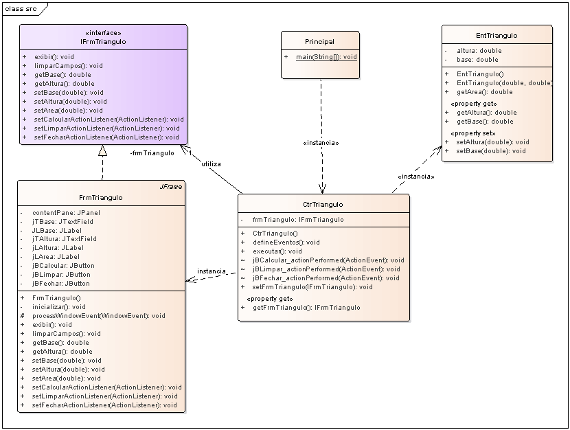

# Aplicação em 3 camadas para o sistema de cálculo da área do triângulo versão 2

## Contextualização

- Realiza o cálculo da área de um triângulo. 
- Aplicação Java desenvolvida em 3 camadas. 
- Esta versão possui uma interface para definição dos métodos da interface.
- Interface gráfica utilizando JFrame. 
- O projeto foi desenvolvido no NetBeans deve ser chamado triangulo3c_v2. 
- Utiliza o Apache Maven para a automatização da construção. 
- A pasta test contêm os testes unitários do projeto utilizando JUnit 5. 

## Diagramas

- Estrutura geral do projeto 

- Diagrama de caso de uso 

- Diagrama de classe 

- Diagrama de sequência 

## Arquivos do projeto

Os arquivos *.EAP são os projetos do sistema utilizando ferramanta CASE Enterprise Arquitect.
`
- Arquivo Modelo1.EAP - Projeto que não especifica classes externas no projeto. (E.g.: JButton, JLabel, ...).
- Arquivo Modelo2.EAP - Projeto que especifica classes externas no projeto. (E.g.: JButton, JLabel, ...).

## Outros arquivos

- pom.xml - Arquivo de configuração da ferramenta de automação Maven.
- *.bat - Arquivos de lote(Batch) de console para tarefas compilar, executar, documentar, empacotar e limpar o projeto.
